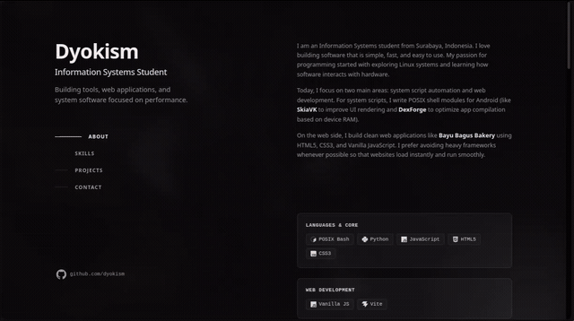

<h1 align="center">🪨 Dyokism Portfolio</h1>

<p align="center">
  A dark-themed personal portfolio showcasing software projects, technical skills, and system tools.
</p>

<br />

<div align="center">
  
</div>

## Lighthouse Audits

| Category | Mobile Score | Desktop Score |
|---|---|---|
| Performance | 100 / 100 | 100 / 100 |
| Accessibility | 100 / 100 | 100 / 100 |
| Best Practices | 100 / 100 | 100 / 100 |
| SEO | 100 / 100 | 100 / 100 |

## Local Development

```bash
# Install dependencies
npm install

# Start development server
npm run dev

# Build for production
npm run build

# Preview production build
npm run preview
```

## Acknowledgments

Design and layout inspired by [Brittany Chiang](https://brittanychiang.com).

## License

This project is licensed under the [MIT License](LICENSE).
